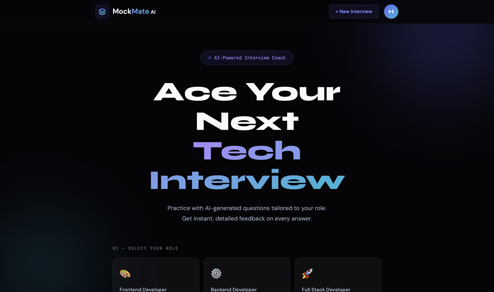
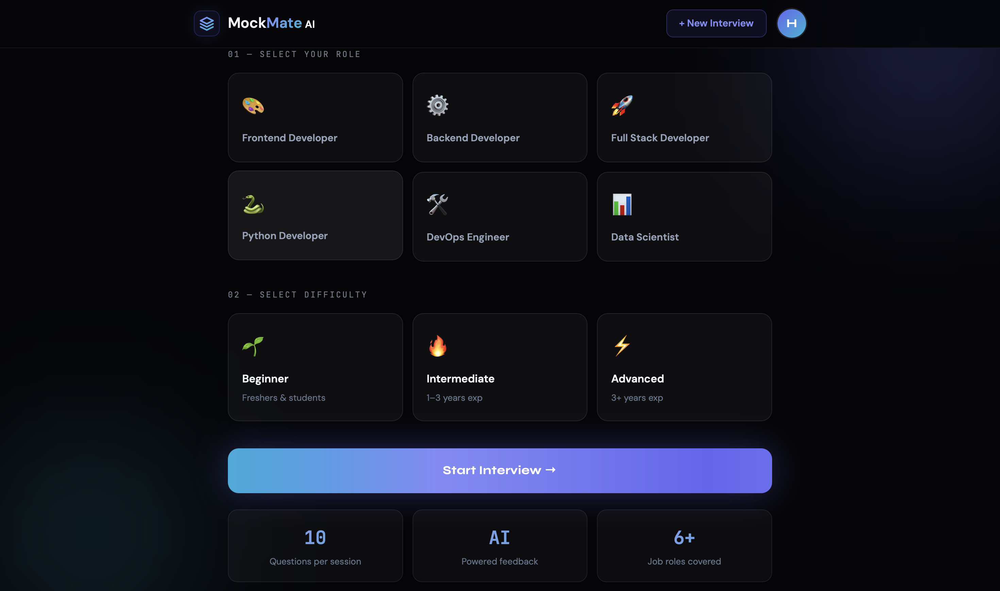
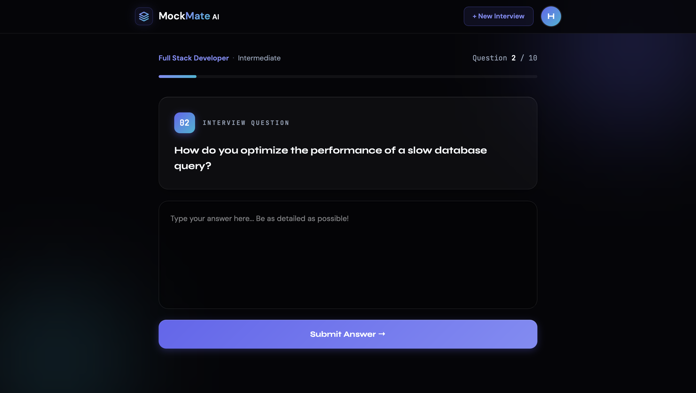
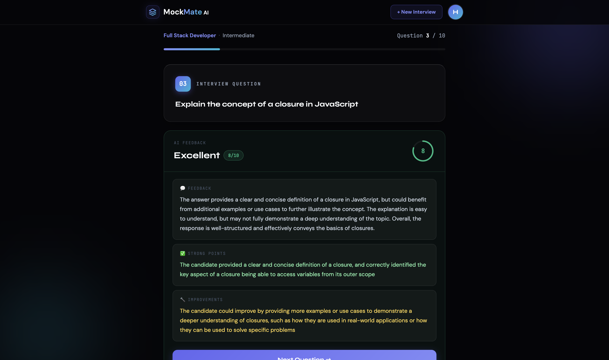
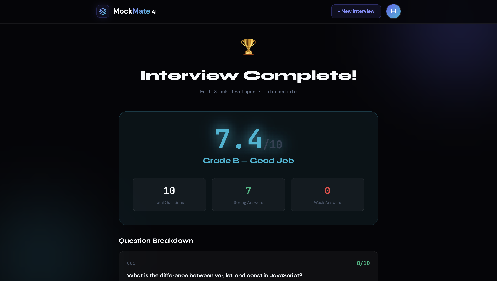

# MockMate AI 🎯

AI-powered interview preparation app that simulates real interview scenarios by generating role-based questions, evaluating answers, and providing structured feedback.

## Features

- Role-based interview questions (Frontend / Backend / Full Stack / Python)
- AI-generated questions using Groq API
- AI evaluation of answers with score and feedback
- Performance insights (strengths & improvements)
- Authentication system (Login / Signup)
- Clean and responsive UI

## Screenshots

### Home



### Interview


### Feedback


### Results


## Tech Stack
- React (Vite)
- Tailwind CSS
- Context API
- Axios
- Groq API (LLM)

## Setup

### 1. Clone the repository

```bash
git clone https://github.com/sweetylearner-max/MockMate-AI.git
cd mockmate-ai
```

### 2. Install dependencies

```bash
npm install
```

### 3. Create `.env` file

```env
VITE_GROQ_BASE_URL=https://api.groq.com/openai/v1
VITE_GROQ_API_KEY=your_api_key
VITE_GROQ_MODEL=your_model
```

### 4. Run the app

```bash
npm run dev
```